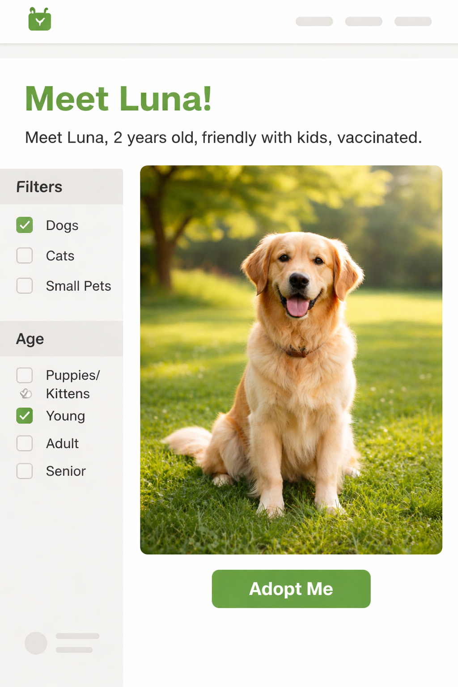

# My Accessibility Buddy


An AI-powered, context-aware alternative text generator that uses surrounding page content to produce WCAG 2.2–compliant descriptions humans and machines can understand.

# [TRY ME!](https://icy-bay-0b3394d10.4.azurestaticapps.net/)

## Introduction
Why does context matters? Are these two images the same?

The slternative text for the first image is: "A golden retriever sitting on grass", while the second is "**Luna**, a **2-year-old** golden retriever **available for adoption**, sitting on grass."

Alt text is a translation of the image’s role in that page’s context

## Features

### Three Main Use Cases
- 👨‍💼 **[For Webmasters](#for-webmasters-generate-wcag-compliant-alternate-text-for-images)**: Generate WCAG-compliant alt-text for individual images via Web UI or CLI
- 🔍 **[For Accessibility Compliance](#for-accessibility-compliance-test-generate-complete-alternative-text-reports-of-web-pages)**: Analyze entire websites and generate comprehensive accessibility reports
- 🔬 **[For AI Engineers](#for-ai-engineers-batch-prompt-comparison-tool)**: Compare and optimize prompt templates with batch testing tools

### Core Capabilities
- 🧠 **Context aware**: Uses page context to refine descriptions
- 📍 **GEO boost**: Generates AI-friendly descriptions optimized for AI search engines (Generative Engine Optimization)
- 🔒 **Privacy**: Use local AI models through Ollama
- 🤖 **AI providers**: OpenAI GPT-4o/5.1/5.2, Claude Sonnet-4/Opus-4, Your enterprise LLM (like ECB-LLM), or Ollama running on local machine with models like Phi, LLava etc.
- ♿ **WCAG 2.2 compliant**: Follows accessibility standards
- 🖼️ **Multi-format support**: JPG, PNG, GIF, WEBP, SVG, BMP, TIFF
- 🌍 **24 EU languages**: Multilingual alt-text generation
- 🔄 **Multiple interfaces**: CLI, Web UI, REST API

## Overview

### Technological innovation
The system injects **page context** into the prompt to generate accessibility descriptions that preserve the meaning of the image.
**GEO boost** adds to the standard prompt instruction that forces the model to produce Generative Engine Optimization–friendly wording, maximizing semantic density for AI consumption.
**Privacy is by design**: The architecture allows descriptions to be generated using local, enterprise, or commercial models, keeping sensitive content within organizational boundaries

### Technical feasibility
**Already functional** on Azure and designed for real editorial workflows.
**Runs anywhere via Docker**, with no dependency on a single cloud or vendor.
Works with commercial and local AI models, supporting **privacy and compliance** needs.

### Business model
We estimated **85% time saved** to generate alt-text. 20% info are lost if you don't have alternative text on your page.
Automating the decision of what is decorative vs. informative, **you save thousands of human hours in manual auditing**.

Target users include **public institutions and large content publishers** subject to WCAG and European Accessibility Act requirements.  
By automating repetitive accessibility tasks while preserving human oversight, the solution reduces editorial effort, lowers compliance costs, and supports sustainable adoption at scale.

### Social impact
Both **visually impaired users and AI** have the possibility to receive descriptions that explain context and intent, not just objects as part of the inclusivity goal.
It allows the users to navigate (a telephone contract page freely), for example, which not only empowers the user but also reduces the cost without calling a human representative.

### Social innovation
Integrated at creation, turning accessibility from a task into a seamless standard.
Real-time analysis that makes images meaningful to both humans and machines.
**Accessibility becomes a normal practice rather than a compliance task**. 
Inclusion scales without sacrificing quality or human oversight.

## Quick Start with Docker 🐳

```bash
# 0. Clone the repo
git clone https://github.com/niclaus76/Innovate-For-Inclusion---MyAccessibilityBuddy.git
cd Innovate-For-Inclusion---MyAccessibilityBuddy

# 1. Setup credentials
cp backend/.env.example backend/.env
# Edit backend/.env and add your LLM keys

# 2. Start with Docker
docker compose up -d

# 3. check the status (myaccessibilitybuddy should be up and running)
docker compose ps

# 4. Open in browser
# Web UI: http://localhost:8000/index.html
# API Docs: http://localhost:8000/api/docs

# 5. Stop, build and restart after conf update
docker stop myaccessibilitybuddy && docker rm myaccessibilitybuddy
docker compose build myaccessibilitybuddy && docker compose up
```
## Configuration
Edit `backend/config/config.json` for basic settings.

Edit `backend/config/config.advanced.json` for advanced settings.

## Documentation
- **[docs/DOCKER_QUICKSTART.md](docs/DOCKER_QUICKSTART.md)** - Get started in 3 minutes with Docker
- **[docs/DOCKER.md](docs/DOCKER.md)** - Complete Docker deployment guide
- **[docs/CLAUDE.md](docs/CLAUDE.md)** - Developer guide and architecture


## Use cases

### For webmasters: generate WCAG compliant alternate text for images

Generate compliant alt-text for single images using the web interface or API. Perfect for content creators and webmasters who need quick, accessible descriptions.

#### Quick Start

```bash
# For web masters, using Web UI:
Open http://localhost:8000/index.html
1. Upload image (drag & drop or browse)
2. Select language(s)
3. Click "Generate"

# To clean all temporary files 
docker exec myaccessibilitybuddy python3 backend/app.py --clear-all --force

Open browser DevTools (F12)
Go to Storage tab → Cookies
Delete the web_session_id cookie
Refresh the page

# To clean a spcific session
To see all available sessions:
docker exec myaccessibilitybuddy python3 backend/app.py --list-session

# For accessibility compliance tests, using CLI (Docker)
1) Download images from a URL into a folder
docker compose exec myaccessibilitybuddy python3 /app/backend/app.py -d --url https://ecb.europa.eu --images-folder /app/input/images --num-images 2 --clear-all --force

2) Extract context for a specific image from a URL
docker compose exec myaccessibilitybuddy python3 /app/backend/app.py -c --url https://ecb.europa.eu --image-name ECB_Eurosystem_OneLineLogo_Mobile_EN.svg --clear-all --force

3) Generate a JSON description starting from an image and its context
docker compose exec myaccessibilitybuddy python3 /app/backend/app.py --legacy -g 1.png --images-folder /app/test/input/images --context-folder /app/test/input/context --language en --report --clear-all --force

4) Process all images in a folder using the context stored in another folder
docker compose exec myaccessibilitybuddy python3 /app/backend/app.py --legacy -p --images-folder /app/test/input/images --num-images 2 --context-folder /app/test/input/context --language en --report --clear-all --force

5) Full workflow: download images and context from a given URL and generates the report
docker compose exec myaccessibilitybuddy python3 /app/backend/app.py -w --url https://ecb.europa.eu --num-images 2 --language en --report --clear-all --force

6) Generate GEO-optimized alt text (AI-friendly for search engines)
docker compose exec myaccessibilitybuddy python3 /app/backend/app.py -g 1.png --language en --geo --report
docker compose exec myaccessibilitybuddy python3 /app/backend/app.py -w --url https://ecb.europa.eu --num-images 2 --language en --geo --report --clear-all --force 

# For AI engineers: Batch Prompt Comparison Tool
# Run with default config (compares prompts v0-v5 on test images)
docker compose exec myaccessibilitybuddy python3 /app/tools/batch_compare_prompts.py
```

#### Configuration

Edit `backend/config/config.json` for provider and model selection:

#### Example Output

```json
{
  "language": "en",
  "current_alt_text": "",
  "proposed_alt_text": "Illustration of ECB steering monetary policy toward a 2% target.",
  "proposed_alt_text_length": 64
}
```

### For accessibility compliance test: generate complete alternative text reports of web pages

Analyze entire websites by scraping images and generating comprehensive accessibility reports. Ideal for compliance audits and testing.

#### Quick Start

```bash
# Using CLI (Docker)
docker compose exec myaccessibilitybuddy python3 /app/backend/app.py -w --url https://ecb.europa.eu --num-images 2 --language en --report --clear-all --force


# Output appears in output/reports/
```

#### Example Output

**HTML Report** (format: `YYYYMMDD-analysis-report-<url>.html`):
- Image analysis overview with statistics
- Image type distribution (decorative/informative/functional)
- Current vs. proposed alt-text comparison
- WCAG compliance recommendations
- Visual previews and detailed reasoning

**Example filename:** `20260113-analysis-report-www.ecb.europa.eu.html`

### For AI engineers: Batch Prompt Comparison Tool

Compare multiple prompt templates to optimize your alt-text quality. The batch comparison tool systematically tests different prompts against test images and generates detailed comparison reports.

#### Quick Start

```bash
# Edit backend/config/config.json -> batch_comparison.prompts and verify the change
docker compose exec myaccessibilitybuddy cat /app/backend/config/config.json | grep "test_geo_boost"

# Compare specific prompts (edit config first)
docker compose exec myaccessibilitybuddy python3 /app/tools/batch_compare_prompts.py
```

#### Configuration

Edit `backend/config/config.json` to customize your test:

```json
{
  "batch_comparison": {
    "prompts": [
      {"file": "processing_prompt_v3.txt", "label": "v3: WCAG focused"},
      {"file": "processing_prompt_v5.txt", "label": "v5: enhanced WCAG"}
    ],
    "test_images": ["1.png", "2.png"],
    "language": "en",
    "test_geo_boost": false
  }
}
```

**GEO Boost Testing:**

The `test_geo_boost` parameter controls how GEO optimization is tested:

- **`"test_geo_boost": false`** (default): Tests each prompt in standard WCAG mode only
  - Generates one alt-text per image per prompt
  - Output: Single column per prompt in reports

- **`"test_geo_boost": true`**: Dual-mode testing - tests each prompt with BOTH standard and GEO optimization
  - Generates TWO alt-texts per image per prompt (standard + GEO)
  - Output: Two columns per prompt in reports (Standard vs. GEO)
  - Ideal for comparing the impact of GEO boost within the same test run

**Example dual-mode output:**

When `test_geo_boost: true`, the CSV will have columns like:
```
Image Filename | v3: WCAG focused (Standard) | v3: WCAG focused (GEO) | v5: enhanced WCAG (Standard) | v5: enhanced WCAG (GEO)
```

This allows you to directly compare how GEO optimization affects each prompt's output quality.

#### Example Output

The tool generates two reports with standardized naming:

**CSV Report** (format: `prompt_comparison_YYYYMMDD-HHMM-SS.csv`):
```
Image Filename,Alt Text (v0: base prompt),Alt Text (v2: WCAG focused)
1.png,"Monetary policy graphic","Illustration showing ECB monetary policy with 2% inflation target"
2.png,"Interest rate chart","Chart displaying key ECB interest rates over time"
```

**Example filename:** `prompt_comparison_20260124-1508-52.csv`

**HTML Report** (format: `prompt_comparison_YYYYMMDD-HHMM-SS.html`):
- Side-by-side comparison of all prompts
- Accessible HTML format
- Visual preview of test images
- Character count and reasoning for each result

**Example filename:** `prompt_comparison_20260124-1508-52.html`

When GEO boost testing is enabled (`test_geo_boost: true`), filenames include `_geo_comparison` suffix:
- `prompt_comparison_20260124-1508-52_geo_comparison.csv`
- `prompt_comparison_20260124-1508-52_geo_comparison.html`

## Report Formats
### 1. Accessibility Compliance Reports
Generated when analyzing web pages for WCAG compliance.
**Format:** `YYYYMMDD-analysis-report-<url>.html`
**Examples:**
- `20260113-analysis-report-www.ecb.europa.eu.html`

**Location:** `output/reports/<session-id>/`

**Generated by:**
- CLI: `python3 app.py -w --url <URL> --report`
- Web UI: Accessibility Compliance tool
- API: `/api/analyze-page` endpoint

### 2. Webmaster Reports
Generated when processing individual images or image batches via the webmaster tool.

**Format:** `webmaster-report-YYYY-MM-DD-HHMMSS.html`

**Example:** `webmaster-report-2026-01-13-143052.html`

**Location:** `output/reports/<session-id>/`

**Generated by:**
- Web UI: Webmaster tool (upload images)
- API: `/api/generate-report` endpoint

### 3. Prompt Comparison Reports
Generated when comparing multiple prompt templates for AI engineering optimization.

**Formats:**
- CSV: `prompt_comparison_YYYYMMDD-HHMM-SS.csv`
- HTML: `prompt_comparison_YYYYMMDD-HHMM-SS.html`
- With GEO testing: `prompt_comparison_YYYYMMDD-HHMM-SS_geo_comparison.csv`

**Examples:**
- `prompt_comparison_20260124-1508-52.csv`
- `prompt_comparison_20260124-1508-52_geo_comparison.html`

**Location:** `output/reports/`

**Generated by:**
- CLI: `python3 tools/batch_compare_prompts.py`
- API: `/api/batch-compare-prompts` endpoint

All reports are saved in the output folder structure defined in `backend/config/config.json` or `backend/config/config.advanced.json`.


## License
Copyright © 2026 Nicola Caione - nicola.caione@gmail.com
All rights reserved.

This software and its associated documentation files (the “Software”) are provided for non-commercial use only.

Permission is hereby granted to use, copy, modify, and distribute the Software solely for personal, educational, research, or non-profit purposes, provided that this copyright notice and this licence statement are included in all copies or substantial portions of the Software.

Commercial use is strictly prohibited, including but not limited to:
Use in products or services that are sold, licensed, or monetized
Use within commercial organizations for internal or external business purposes
Use as part of paid consulting, training, or support services
Any commercial use requires prior written permission from the copyright holder.

THE SOFTWARE IS PROVIDED “AS IS”, WITHOUT WARRANTY OF ANY KIND, EXPRESS OR IMPLIED, INCLUDING BUT NOT LIMITED TO THE WARRANTIES OF MERCHANTABILITY, FITNESS FOR A PARTICULAR PURPOSE, AND NON-INFRINGEMENT. IN NO EVENT SHALL THE AUTHOR BE LIABLE FOR ANY CLAIM, DAMAGES, OR OTHER LIABILITY ARISING FROM THE USE OF THE SOFTWARE.

## Project Information

**Created for**: Innovate for Inclusion Hackathon
**Version**: 5.0.0 (see [CHANGELOG.md](CHANGELOG.md) for details)
**Last Updated**: January 2026
